<p align="center">
  <a href="https://ancizartorres19.github.io/portafolio-personal/">
    
  </a>
</p>

<p align="center">
  <a href="https://ancizartorres19.github.io/portafolio-personal/"></a>
  <a href="https://www.linkedin.com/in/ancizar-torres-lopez-673a591a1/"></a>
  <a href="mailto:ancizar.torres.dev@gmail.com"></a>
  <a href="https://twitter.com/ancizartorres19"></a>
  <a href="https://instagram.com/ancizar_torres19"></a>
</p>

<p align="center">
  
</p>

## `> whoami`

```ts
const ancizar = {
  role: "Frontend Developer · Full Stack",
  basedIn: "Villavicencio, Colombia 🇨🇴",
  currently: "Multisalud SAS",
  previously: ["Gaffel", "Inteia", "Hewtec"],
  experience: "5+ years building enterprise web apps",
  focus: ["React", "Next.js", "TypeScript", "Node.js"],
  exploring: ["3D & AR on the web", "Docker + Azure", "LLMs with Python"],
};
```

## `> tech --stack`

<table align="center">
  <tr>
    <td align="center"><b>Frontend</b></td>
    <td></td>
  </tr>
  <tr>
    <td align="center"><b>Backend</b></td>
    <td></td>
  </tr>
  <tr>
    <td align="center"><b>Mobile</b></td>
    <td> </td>
  </tr>
  <tr>
    <td align="center"><b>Cloud &amp; DevOps</b></td>
    <td></td>
  </tr>
  <tr>
    <td align="center"><b>Testing &amp; more</b></td>
    <td></td>
  </tr>
</table>

## `> ls ./featured`

| | Project | What it is | Stack | |
|:-:|---|---|:-:|:-:|
| 💪 | **Level Up** <sub>🔒 private</sub> | Multi-tenant CrossFit platform in production: web, API and mobile app |  | [**Live ↗**](https://www.levelupcrossfit.com) |
| 🥽 | **Restaurant AR Menu** <sub>🔒 private</sub> | Digital menu that places each dish at real size on your table with 3D &amp; AR |  | [**Live ↗**](https://ram-carta-3d-ar.vercel.app) |
| 🧭 | **[Portfolio](https://github.com/AncizarTorres19/portafolio-personal)** | Interactive portfolio with 20 projects and live demos |  | [**Live ↗**](https://ancizartorres19.github.io/portafolio-personal/) |
| 🐳 | **[Docker Fundamentos](https://github.com/AncizarTorres19/curso-de-docker-fundamentos)** | nginx + Flask with Docker Compose, deployed on Azure Container Apps |  | [**Live ↗**](https://curso-frontend.ambitioussky-6c4af529.westus2.azurecontainerapps.io) |
| 🎓 | **Portal AUNAR** <sub>🔒 private</sub> | Events and students admin portal, web side of my degree project |  | [**Live ↗**](https://v0-proyecto-de-grado-web.vercel.app) |
| ⚡ | **Marvel Challenge** <sub>🔒 private</sub> | Tech challenge: search, pagination and favorites over Marvel comics |  | [**Live ↗**](https://marvel-challenge-prueba.vercel.app) |

<p align="center">
  📚 Open-source learning paths in Spanish:
  <a href="https://github.com/AncizarTorres19/java-ruta-profesional"><b>Java</b></a> ·
  <a href="https://github.com/AncizarTorres19/dotnet-ruta-profesional"><b>.NET</b></a> ·
  <a href="https://github.com/AncizarTorres19/docker-avanzado"><b>Docker avanzado</b></a>
</p>

## `> git log --stats`

<p align="center">
  
  
</p>

<p align="center">
  
</p>

<p align="center">
  <picture>
    <source media="(prefers-color-scheme: dark)" srcset="./profile/snake-dark.svg" />
    <source media="(prefers-color-scheme: light)" srcset="./profile/snake-light.svg" />
    
  </picture>
</p>


